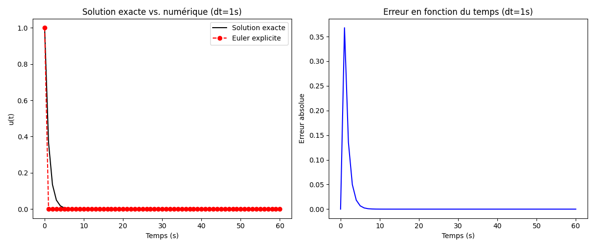
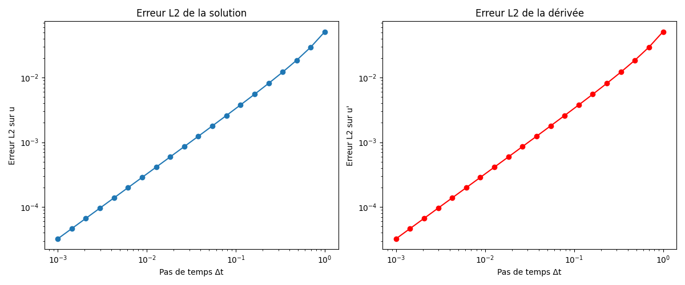
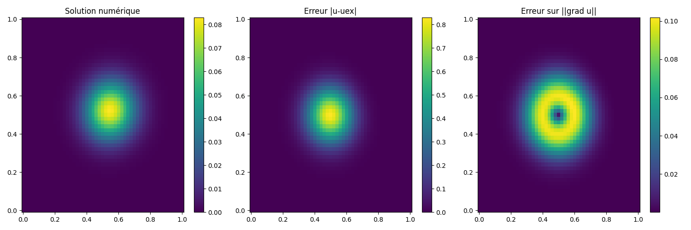

# Séance 1

## 📘 Problème étudié 1 : Méthode d’Euler explicite pour une EDO
On considère l’équation différentielle ordinaire suivante :

$$
u'(t) = -\lambda\,u(t),\qquad u(0)=u_0=1,\qquad \lambda=1
$$

La solution exacte est connue :

$$
u_{\text{exact}}(t) = u_0 e^{-\lambda t}
$$

---

## 🔹 Schéma d’Euler explicite
Le schéma d’Euler explicite s’écrit :

$$
u_{n+1} = u_n + \Delta t \cdot f(t_n, u_n)
$$

où :
$$
f(t,u) = -\lambda u 
$$.  
Ainsi :

$$
u_{n+1} = u_n - \Delta t \, \lambda u_n
$$

ou encore :

$$
u_{n+1} = (1 - \lambda \Delta t)\, u_n
$$

---

## 📊 Objectifs du code
Le script `Euler_ODE_Errors.py` permet de :

1. Résoudre l’équation différentielle par Euler explicite pour un pas de temps fixé ($\Delta t = 1s$) sur un intervalle de 1 minute.  
2. Comparer la solution numérique avec la solution exacte.  
3. Tracer :
   - la solution exacte et la solution numérique,  
   - l’erreur en fonction du temps,  
   - les erreurs $L^2$ de la solution et de sa dérivée en fonction du pas de temps ($\Delta t \in [1, 0.001]$).
  

  

## 📘 Problème étudié 2 : Transport–diffusion–réaction
On considère l’équation aux dérivées partielles suivante dans un domaine rectangulaire :

$$
u_t + v_1 u_x + v_2 u_y - \nu (u_{xx} + u_{yy}) = -\lambda u + f(t,x,y),
$$

avec la source définie par :

$$
f(t,s) = T_c \exp\big(-k \, d(s,s_c)^2\big),
$$

où :

$$
d(s,s_c)^2 = (x-x_c)^2 + (y-y_c)^2.
$$

---

## 🔹 Conditions aux limites
- **Dirichlet** uniquement sur les bords **entrants**, c’est-à-dire là où le produit scalaire entre la vitesse et la normale est strictement négatif : $V \cdot n(s) < 0.$

- **Condition initiale** : en général $u(0,x,y)=0$ (ou définie selon le cas d’étude).

---

## 🔹 Méthode numérique
- Discrétisation spatiale : différences finies sur une grille régulière.  
- Transport : schéma **amont (upwind)** pour les termes $v_1 u_x + v_2 u_y$.  
- Diffusion : schéma **centré** pour le Laplacien $u_{xx}+u_{yy}$.  
- Réaction : $-\lambda u$.  
- Source : gaussienne centrée en $s_c$.  
- Avancement en temps : **Euler explicite**.

---

## 📊 Objectifs du code
Le script Python associé permet de :
1. Résoudre l’équation de transport–diffusion–réaction dans un domaine rectangulaire.  
2. Illustrer :
   - La **solution numérique** $u(t,x,y)$.  
   - L’**erreur $L^2$ sur la solution**.  
   - L’**erreur $L^2$ sur la norme du gradient**.  
3. Présenter les **trois figures côte à côte** (solution, erreur sur $u$, erreur sur $\nabla u$).

---

## ⚙️ Données
- Domaine rectangulaire : $[0,L_x] \times [0,L_y]$.  
- Vitesse : $V=(v_1,v_2)$.  
- Paramètres :
  - $\nu$ : coefficient de diffusion,  
  - $\lambda$ : coefficient de réaction,  
  - $T_c$ : amplitude de la source,  
  - $k$ : largeur de la gaussienne,  
  - $s_c=(x_c,y_c)$ : centre de la source.
 

## 🔹 Passage du 2D au 1D
En 2D, l’équation générale est :

$$
u_t + v_1 u_x + v_2 u_y - \nu (u_{xx} + u_{yy}) = -\lambda u + f
$$

En 1D :
- On supprime la variable $y$ et les termes associés.
- Il reste :
$u_t + v_1 u_x - \nu u_{xx} = -\lambda u + f$

---

## 🔹 Condition initiale compatible
On cherche $u_0(x)$ tel que :
- $u_0(0) = u_l$
- $u_0'(L) = g$

Une solution simple est : 
$u_0(x) = u_l + g x $

Car :
- $u_0(0) = u_l$
- $u_0'(L) = g$

---

## 🔹 Discrétisation par différences finies
- **Dérivée seconde centrée** : $u''(x_i) \approx \frac{u_{i+1} - 2u_i + u_{i-1}}{h^2}$
→ Ordre 2 au centre du domaine.

- **Dérivée première centrée** : $u'(x_i) \approx \frac{u_{i+1} - u_{i-1}}{2h}$
→ Ordre 1 au centre.

