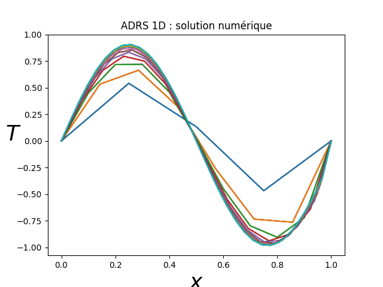
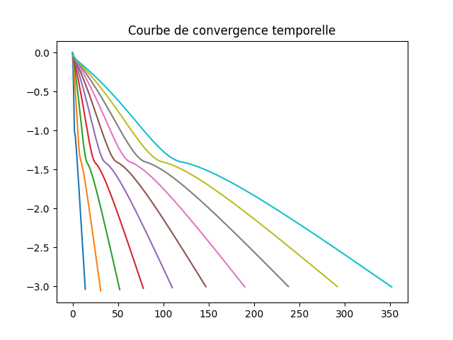
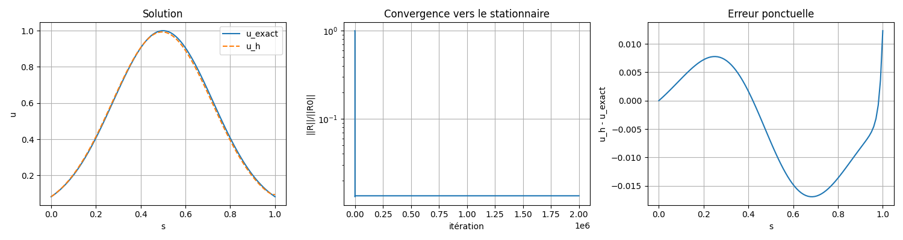
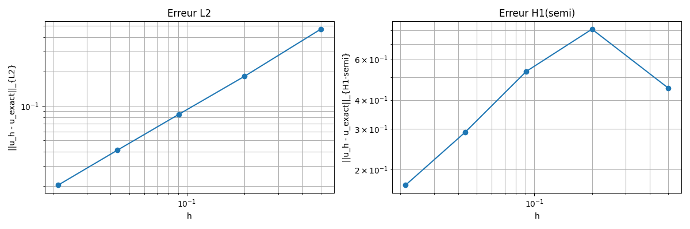

# Transport–Diffusion–Réaction

## Partie 1 — Code `adrs.py`

### 🎯 But
Résoudre numériquement en 1D, par marche en temps vers l’état stationnaire, l’EDP : 

$$ 
u_t + V\,u_x - K\,u_{xx} + \lambda\,u = F(x)
$$

sur 

$$ 
x\in[0,L] 
$$

avec un schéma explicite en temps.

### 🧱 Ce que fait le code
- **Raffinement du maillage** : `for iter in range(niter_refinement): NX = NX + 3` → maillage de plus en plus fin.
- **Pas de temps (CFL)** : `dt = dx**2/(V*dx + K + dx**2)` (puis ajusté) → contrainte CFL advection/diffusion/réaction.
- **Schéma spatial** :
  - Dérivées **centrées** pour $u_x, u_{xx}$.
  - **Viscosité numérique** via `xnu = K + 0.5*dx*abs(V)` (idée “centré + viscosité num.”).
- **Marche en temps** : Euler explicite jusqu’à `res/res0 < eps` (convergence vers stationnaire).
- **CL actuelles (de fait)** : `T[0]` et `T[-1]` jamais imposés explicitement → **Dirichlet homogène** aux deux bords.
- **Forçage F** : construit à partir d’une “référence” interne `Tex` (pas une solution analytique).

---

## Partie 2 — Code modifié

### ✅ Objectif
Version qui :
1) utilise un **maillage fixe** (ex. $N=100$),  
2) remplace la “viscosité numérique” par un **schéma amont (upwind)** pour l’advection,  
3) applique une **CFL standard**,  
4) impose **Dirichlet non homogène** à gauche et **Neumann** à droite $u_x(L)=0$,  
5) **fabrique** un forçage $f$ à partir d’une **solution exacte** et **vérifie** qu’on la retrouve,  
6) montre la **convergence** vers le stationnaire et **mesure les erreurs** $L^2$ et $H^1$ sur plusieurs maillages.

### 🔢 Problème test (solution fabriquée)
On prend :
$u_{\text{ex}}(x)=\exp(-10(x-\tfrac{L}{2})^2)$
$\qquad L=1, V=1, \nu=0.01, \lambda=1$ .

En stationnaire $u_t=0$,

On définit :
$f(x)$

=V\,u'_{\text{ex}}(x)\;-\;\nu\,u''_{\text{ex}}(x)\;+\;\lambda\,u_{\text{ex}}(x).

Avec $r=x-\tfrac{1}{2}$ :
$$
u'_{\text{ex}}(x)=-20\,r\,u_{\text{ex}}(x),\qquad
u''_{\text{ex}}(x)=\big(-20+400\,r^{2}\big)\,u_{\text{ex}}(x),
$$
donc
$$
\boxed{\,f(x)=u_{\text{ex}}(x)\,\big(-4\,r^{2}-20\,r+1.2\big)\,}.
$$

### 🧩 Discrétisation
- **Maillage uniforme** : $x_i = i\,h,\; i=0..N-1,\; h=L/(N-1)$.
- **Advection (upwind)** :  
  `if V>=0: u_x[i]=(u[i]-u[i-1])/h else: u_x[i]=(u[i+1]-u[i])/h`.
- **Diffusion (centrée, ordre 2)** : $u_{xx}(x_i) \approx (u_{i-1}-2u_i+u_{i+1})/h^2$.
- **Temps (Euler explicite)** : $u^{n+1} = u^n + \Delta t(-V u_x^n + \nu u_{xx}^n - \lambda u^n + f)$.

### 🧱 Conditions aux limites
- **Gauche (Dirichlet non homog.)** : $u(t,0)=u_{\text{ex}}(0)$ → `u[0]=u_ex(0)`.
- **Droite (Neumann homog.)** : $u_x(L)=0$ → `u[-1]=u[-2]` (pente nulle au bord droit).

### ⏱️ CFL (stabilité)
$$
\Delta t \le \frac{1}{|V|/h + 2\nu/h^2 + \lambda} \times 0.9.
$$

### 🚦 Convergence vers le stationnaire
- Critère : **résidu normalisé** $\|R^n\|_{L^2}/\|R^0\|_{L^2}$ avec $R=-V u_x + \nu u_{xx} - \lambda u + f$.
- Variante : $\|u^{n+1}-u^n\|_{L^2}/\|u^1-u^0\|_{L^2}$.

### 📏 Erreurs après convergence
- $L^2$ : $\|u_h-u_{\text{ex}}\|_{L^2} \approx \sqrt{h\sum_i (u_i-u_{\text{ex},i})^2}$.  
- $H^1$ (semi-norme) : $\|(u_h-u_{\text{ex}})'\|_{L^2}$ via dérivée centrée.

### 🔁 Étude sur 5 maillages
Ex. $N=\{3,6,12,24,48\}$. Tracer $\|u_h-u_{\text{ex}}\|_{L^2}$ et $\|(u_h-u_{\text{ex}})'\|_{L^2}$ **en fonction de $h$** (log–log).

